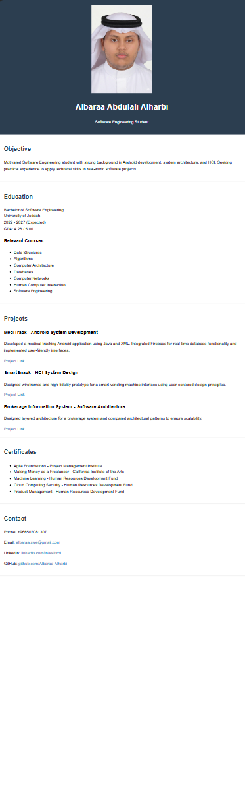
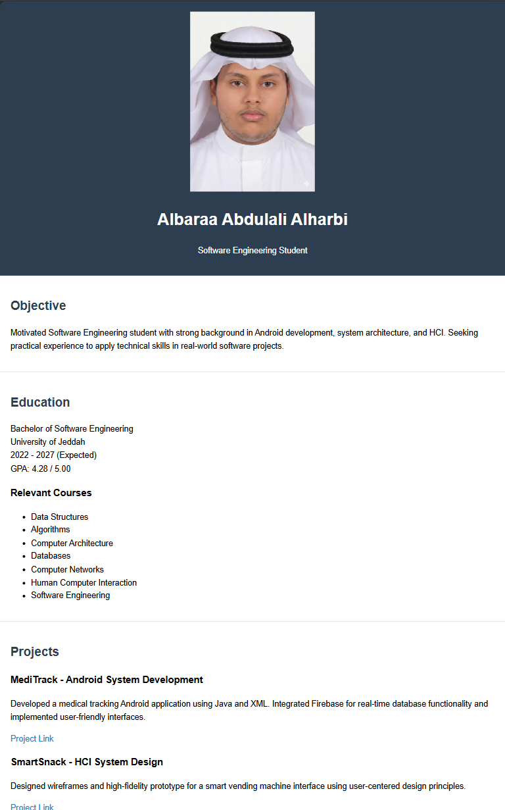
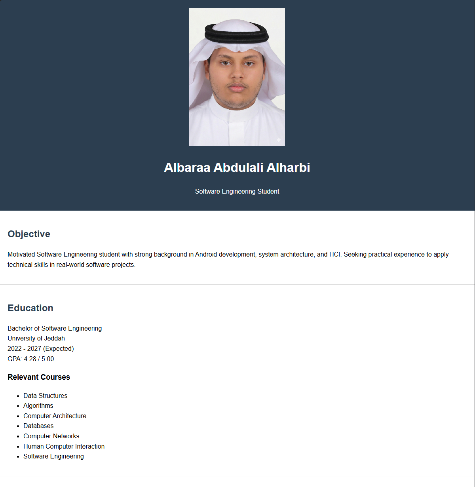

# Web Development Assignment

This directory contains a **front-end web development project** demonstrating
responsive design, HTML structure, and CSS styling.

---

## 📁 Project Structure

```text
web-development-assignment/
├── index.html
├── style.css
├── images/
│   └── App.jpg
└── screenshots/
    ├── 375px.png
    ├── 768px.png
    └── 1200px.png
```

* `index.html` → main project page
* `style.css` → styling for the page
* `images/` → project images (App.jpg, icons, etc.)
* `screenshots/` → screenshots demonstrating responsiveness at different viewport widths

---

## 🖥 Screenshots

| Mobile (375px)                | Tablet (768px)                | Desktop (1200px)                |
| ----------------------------- | ----------------------------- | ------------------------------- |
|  |  |  |

---

## 🎯 Objective

* Build a structured, responsive web page
* Apply HTML5 semantic elements and clean CSS practices
* Demonstrate layout consistency across multiple screen sizes
* Organize project files in a maintainable way

---

## 🛠 Technologies Used

* HTML5
* CSS3
* CSS Grid
* Flexbox
* Responsive Design Principles

---

## 👤 Student Information

* Name: Albaraa Alharbi
* Student ID: 2342673